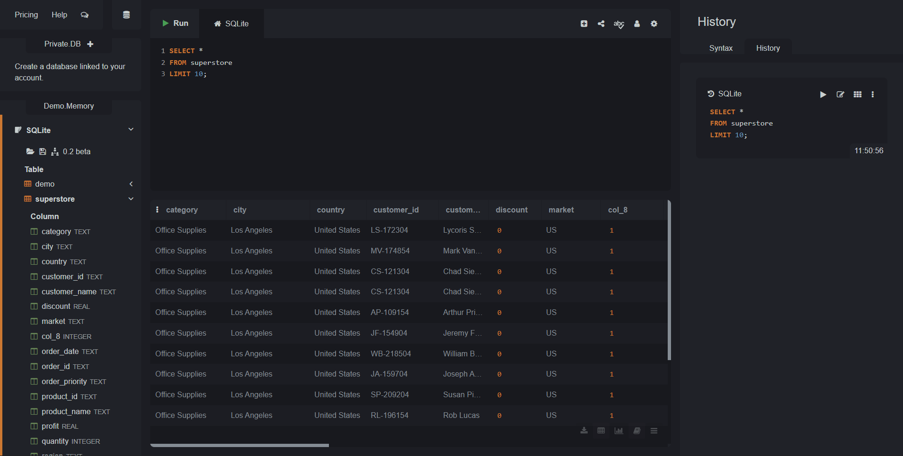
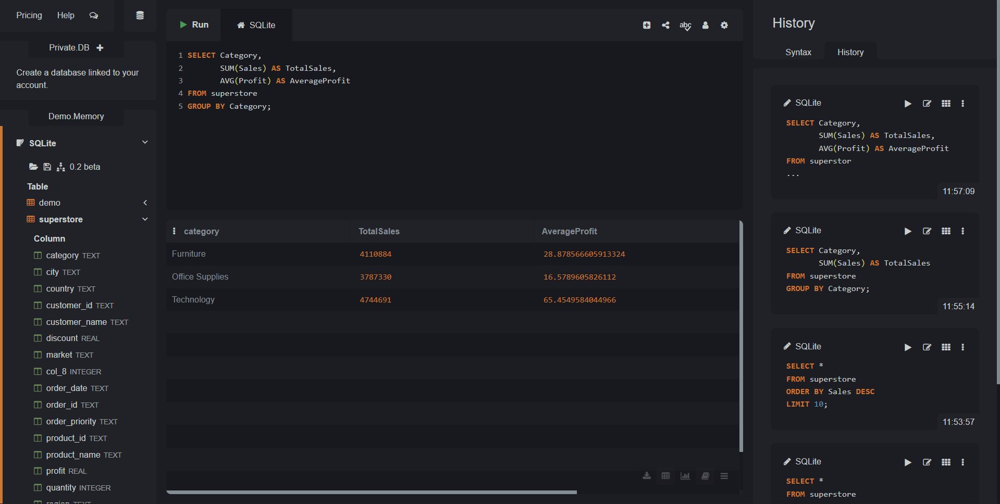
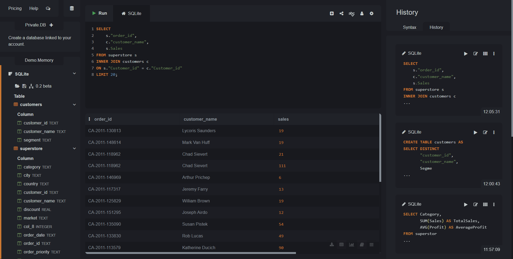
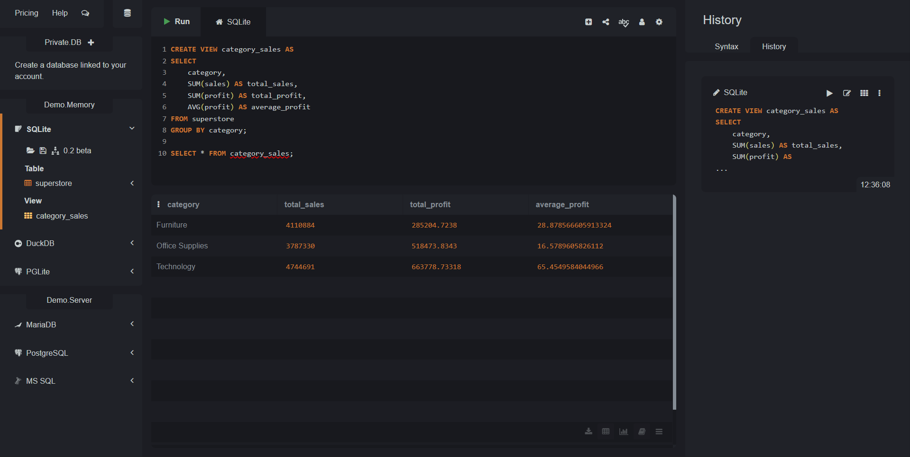
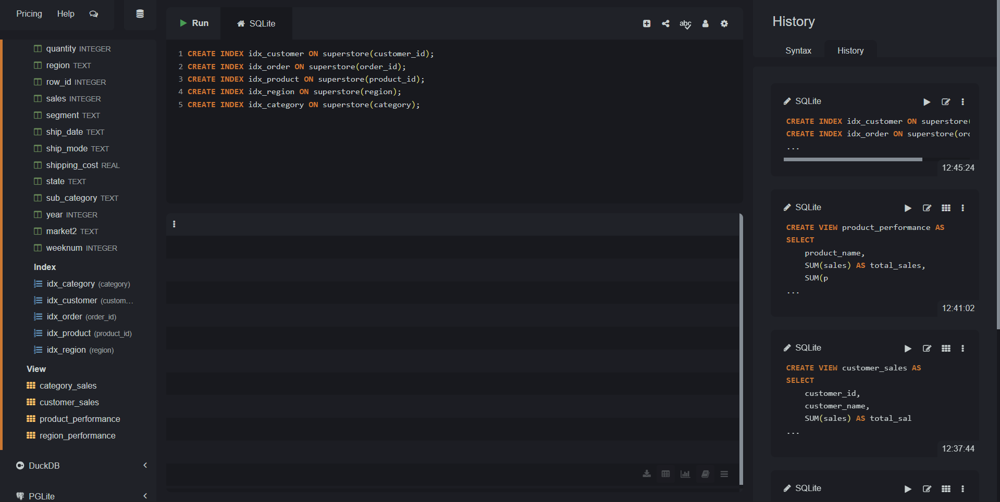

# Global Superstore SQL Analysis

## Objective

The objective of this project is to perform data analysis using SQL on the Global Superstore dataset. The project demonstrates how structured data can be queried, filtered, aggregated, and optimized using SQL techniques such as joins, views, and indexes.

## Dataset

Global Superstore Dataset (E-commerce sales dataset containing information about customers, orders, products, sales, profit, region, and shipping details).

## Tools Used

* SQLite (DB Browser / SQLite Online)
* SQL (Structured Query Language)
* Global Superstore Dataset (CSV format)

## Project Features

* Data exploration using SELECT queries
* Filtering data using WHERE conditions
* Sorting data using ORDER BY
* Aggregation using GROUP BY, SUM, and AVG
* Joining tables using INNER JOIN and LEFT JOIN
* Creating views for analytical summaries
* Query optimization using indexes
* Business insights generation from sales data

## Key Insights

* Identified top-performing product categories based on total sales
* Analyzed regional performance in terms of sales and profit
* Determined top customers contributing to maximum revenue
* Found products with highest sales and profitability
* Evaluated overall business performance using aggregated metrics

## Outcome

This project demonstrates practical SQL skills for data analysis, including data extraction, transformation, aggregation, and optimization. It helps in understanding how businesses use SQL to derive insights from large datasets and make data-driven decisions.

## PROJECT PREVIEW

### SELECT Query Overview

### AGGREGATE Query Overview

### INNER JOIN Query Overview

### VIEW Query Overview

### INDEX Query Overview

## Files Included

* SQL File (`Global_Superstore_Sql_Analysis.sql`)
* Dataset (`superstore.csv`)
* SCREENSHOTS
* README File (`README.md`)
